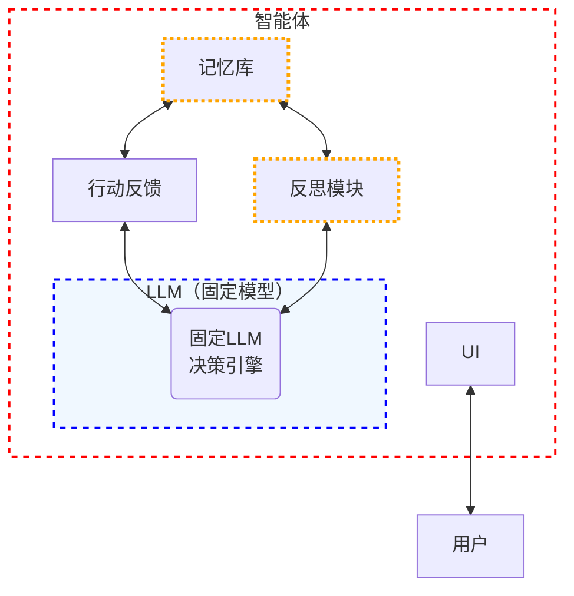
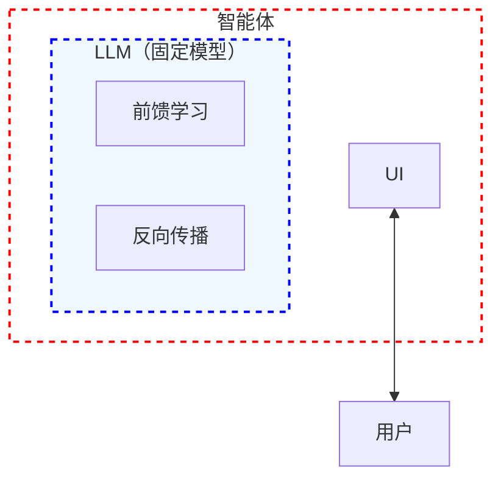
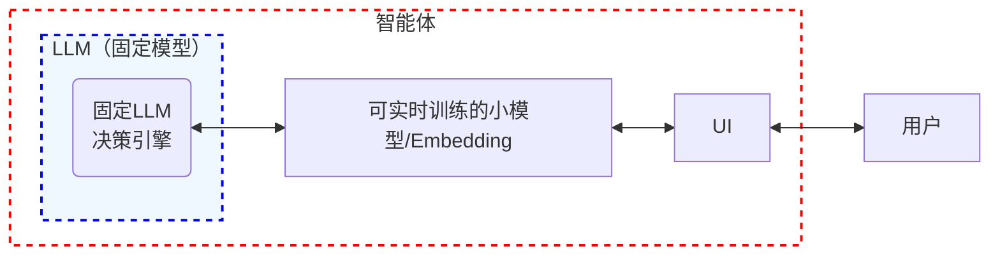

【文章】强化学习在支持智能体（大模型应用）方向上的应用前景分析。
上一篇文章说到了大模型记忆的重要性。本来想着这次就分析一些具体的开源项目，但是想到“智能体外挂记忆”这个技术选型的重要性是有一个前提的。

> 我常常信奉的办事原则是，知道自己需要什么很重要，但知道自己为什么需要更重要。

那么，我们为什么需要智能体记忆呢？在这个主流厂商都追逐“更大”、“更强”模型的时候，我们为什么另辟蹊径？
首先，我认为未来AGI，或者是接近其目标的落地产品，其最终形态一定不是一个通用的模型或者是通用的智能体，它一定是一个承载着和任意一个用户不同经历，不同定位的专属小助手。详情可以参考这篇文章。

但是这篇文章，其实默认带入了一个默认前提就是**模型是不可以改变的**。也就是说，模型始终是由 openai 类似的服务商通过API显示提供的，对于模型内，我们没什么可调的选择。
那么模型是不是真的不可以改变？本着清楚我们从哪里来到哪里去的原则，我们还需要设想一下其他的一些方案（**毕竟谁也不想让自己辛辛苦苦设计的方案，做的调研，被降维打击，不是吗？**），这篇文章我们就探索一下，强化学习在支持智能（大模型应用）方向上的应用前景。

# 为什么是强化学习
智能体怎么又强化学习扯上关系了？

> 我们假设是未来你的私人小助手贾维斯刚刚入职的公司，那么他对你和你的业务，一定是一无所知的，对吧？
> 他会像一个普通的员工一样开始和你交流并且通过合作和交流，慢慢变得懂你？
> 这个过程不就是强化学习的过程吗？即，一无所知的贾维斯（智能体），刚到你们公司（刚开始和你合作）什么都不懂，总是犯错，通过你的纠正，以及实践的一些反馈，反过来修正他的行为，此过程可以抽象为：`实践 - 学习 - 再实践 - 再学习 ...` 的过程。

既然这样的 LLM应用产品或者说助手，是我们的产品目标。那么问题就变成了：
**如何把RL这套机制“塞”进我们以LLM为核心的智能体架构里？**

我想到了三个方法，我们来逐一分析它们的潜力和大坑：

### 范式一：智能体外挂RL - “记忆+反思”模拟学习

*   **核心思想：** 把LLM当作一个强大的、但**固定不变**的“决策引擎”。RL的学习过程由智能体架构的外部组件（记忆库+反思/规划模块）来模拟。LLM根据当前输入（用户指令+记忆上下文）输出行动（响应/调用工具），系统根据结果（用户反馈/任务成败）更新记忆，并通过“反思”环节（可能由另一个LLM调用）生成“经验教训”存入记忆，指导未来行为。
*   **优势：**
    *   **可行性高（当前）：** 完全基于现有技术（LLM API + 向量数据库 + Prompt工程）。不碰模型微调，部署相对简单。
    *   **规避核心难题：** 绕开了直接微调大模型的巨大资源消耗和稳定性问题（灾难性遗忘）。
    *   **可解释性？** 可能比微调模型更容易理解“为什么这么做”（通过查看记忆和反思记录）。
*   **痛点/质疑：**
    *   **存储信息有限：** 它本质上是通过 few-shot/in-context-learning 的方式指导 LLM 如何按照何等方式去执行任务，占用的是模型的输入 Token。 这就不可避免的会导致诸如，语言无法描述的行为习惯、占用太多输入 token 导致任务执行效果变差，等问题。
    *   **高质量、通用的优秀记忆框架缺失：** 优秀的记忆框架可以抽象为：存储 和 查找 两大块，但是目前还没有一款能媲美人类记忆的通用记忆框架，这部分后面会有文章详细说明，敬请期待。
    *   **“反思”的质量瓶颈：** 负责“反思”的LLM本身能力不足或Prompt设计不佳，可能导致生成的“经验”质量差，甚至引入错误，污染记忆库。
*   **总结：** 这是目前最现实的路径，能快速搭建出有一定“学习”感的智能体。但**它可能只是RL的一种“弱形式”模拟**，其上限受限于外部模块的设计和基础LLM的能力。它很可能无法实现真正意义上的“成长”和“深度适应”。

### 范式二：个性化实时RL微调LLM - “专属大脑”的愿景

*   **核心思想：** 每个用户拥有一个**个性化的小型LLM**（可以是微调基座模型，或从头训练的小模型）。这个模型使用RL（很可能是RLHF）技术，**实时或近实时地**根据用户交互数据进行持续微调，实现真正的“终身学习”。这是一种真正近似人类学习的过程，人脑的每次推理与其说是推理，不如说是“训练”阶段的前馈传播，在经过客观世界的真实反馈后实时的调整参数。
*   **优势：**
    *   **真正的学习与适应：** 直接修改模型参数，意味着模型**内部表征和推理能力在进化**。它能更本质地理解用户的独特需求，潜力最大，最接近“贾维斯入职成长”的愿景。
    *   **潜力：** 可能实现更深层次的行为改变、更自然的个性化交互、更强的处理新情境能力。
*   **痛点/质疑（这里的坑深不见底）：**
    *   **资源消耗：地狱级！** 
        *   **推理成本：** 即使是“小型”LLM（比如7B参数），要保证基本“智力”可用，对普通用户的设备（手机、PC）来说，实时推理的算力和能耗都是巨大挑战。云部署则涉及成本分摊和延迟问题。
        *   **训练成本：** RL微调（尤其RLHF）比监督微调更耗资源。**实时/持续**微调？对硬件（GPU内存、带宽）和算法（高效参数更新）的要求是天文数字。别忘了数据存储和传输的成本。
    *   **灾难性遗忘：** 持续学习老难题。模型在为你“个性化”的过程中，会不会把基座模型辛苦学到的通用知识/能力给覆盖（遗忘）了？如何平衡“专精你”和“保持通用能力”？
    *   **数据效率与质量：** RL notoriously data-hungry（RL臭名昭著地吃数据）！用户交互产生的有效训练数据（带高质量反馈信号）是稀疏且缓慢积累的。训练一个RL模型需要海量交互数据。**需要多久才能训出效果？** 而且，用户反馈信号本身可能噪音大、有偏差。
    *   **稳定性与安全性：** 实时更新模型参数，如何保证系统稳定性？如何防止恶意反馈“教坏”模型？如何调试和追溯问题？
    *   **收敛性问题：** RL的优化目标更复杂（长期累积奖励），收敛本身就更困难、更不稳定。在稀疏、有噪音的个性化数据上训练，能收敛吗？会收敛到一个好策略吗？
*   **总结：** 这是最诱人、上限最高的终极目标，但**以当前和可见未来的技术（硬件、算法、数据效率），它几乎是一个“科幻”场景**。除非在模型小型化（Mistral 7B这类是方向）、高效微调技术（LoRA, QLoRA）、RL算法效率和数据利用效率上有**革命性突破**，否则落地极其困难。

### 范式三：中庸之道 - “大底座 + 小适配器”

*   **核心思想：** 保持一个强大的、通用的**基座LLM固定不变**。每个用户拥有一个**极小的、可训练的“适配器”模块**（比如 LoRA, Prefix Tuning, Adapter 层）。用RL技术，**只对这个微小的适配器**进行个性化训练和更新。训练时只需加载适配器，推理时将适配器与基座模型结合。
*   **优势：**
    *   **资源消耗大幅降低：** 只训练和存储极小的适配器参数（可能只有基座模型的0.1%-10%），训练成本、存储成本、传输成本大大低于范式二。
    *   **规避灾难性遗忘：** 基座模型的通用知识和能力被冻结保护，理论上不会被破坏。
    *   **部署相对灵活：** 适配器体积小，易于分发、更新。
*   **痛点/质疑：**
    *   **能力瓶颈：** 这个小适配器能“学会”多少？它的表征能力是否能充分捕捉用户极其复杂的个性化需求？**它会不会只是一个更精致的“偏好记忆器”？** 对复杂行为的调整可能力不从心。
    *   **RL效果存疑：** 在如此受限的参数空间上应用RL进行学习，能否有效找到好的策略？RL的优化过程在这个范式下是否依然有效且高效？
    *   **与基座模型的交互：** 小适配器如何与庞大的基座模型有效协作？会不会产生难以预料的交互副作用？
    *   **技术成熟度：** P-Tuning等高效微调技术在监督学习（SFT）上效果不错，但在**RL场景下**的应用和效果验证还远不充分。
*   **总结：** 这看起来是目前**理论上最有希望平衡“个性化学习”、“可行性”、“成本”的技术路径**。它结合了范式一（不动大模型）和范式二（真更新参数）的一些优点。**但核心问题在于：这个小东西到底能学会多复杂的用户专属行为？以及RL用在它身上效果到底好不好？** 这需要大量的实验验证。

### 总结下来：路在何方？我们得捋清

1.  **短期现实（1-3年？）：范式一（外挂记忆+反思）是主力。** 它能快速落地，解决显性的“记忆”问题，提供初步的“学习感”。实时上，这也是目前为看到的主流技术路线。我们要努力提升记忆检索效率、反思Prompt质量、反馈机制设计，压榨它的潜力。很多成功的Agent项目（AutoGPT, LangChain生态的应用）其实都在这个范畴内。
2.  **中期探索（3-5年+？）：范式三（大模型+小RL适配器）是主攻方向。** 它最有希望突破范式一的天花板，实现更深刻的个性化。**当前最迫切的研究需求就是：验证高效微调技术（如LoRA）在LLM的RL/RLHF场景下的有效性、效率和能力上限！** 需要看学术界和工业界在这个交叉点的突破。我目前还没有看到相关研究（似乎大家都不太关心实时学习这个技术路线），欢迎不同意见的小伙伴在评论区里提醒。
3.  **长期愿景（>5年？）：范式二（个性化小模型+实时RL）是星辰大海。** 它依赖于硬件（更强大的个人设备/更便宜的云算力）、算法（高效能小模型、数据高效的RL、稳定持续学习）、基础设施（模型分发、更新、安全）等多方面的共同进步。

**所以，回到原点：我们为什么需要记忆？为什么探讨 RL 在 Agent 里的应用？**
*   需要**记忆**，是为了让智能体“认识你”（你的历史、偏好、上下文）。
*   需要**学习（尤其是RL）**，是为了让智能体“理解你”并“为你改变”（进化行为策略，适应你的独特需求），能够真正应用在你的生活里，成为你的贾维斯。

**我们现在做的技术选型，就是在找一个最可行的路径，让智能体从“认识你”走向“为你而变”。**

下一篇，我们将看看开源的 LLM 应用记忆框架，看看距离我们打造这样一款产品还差多远。